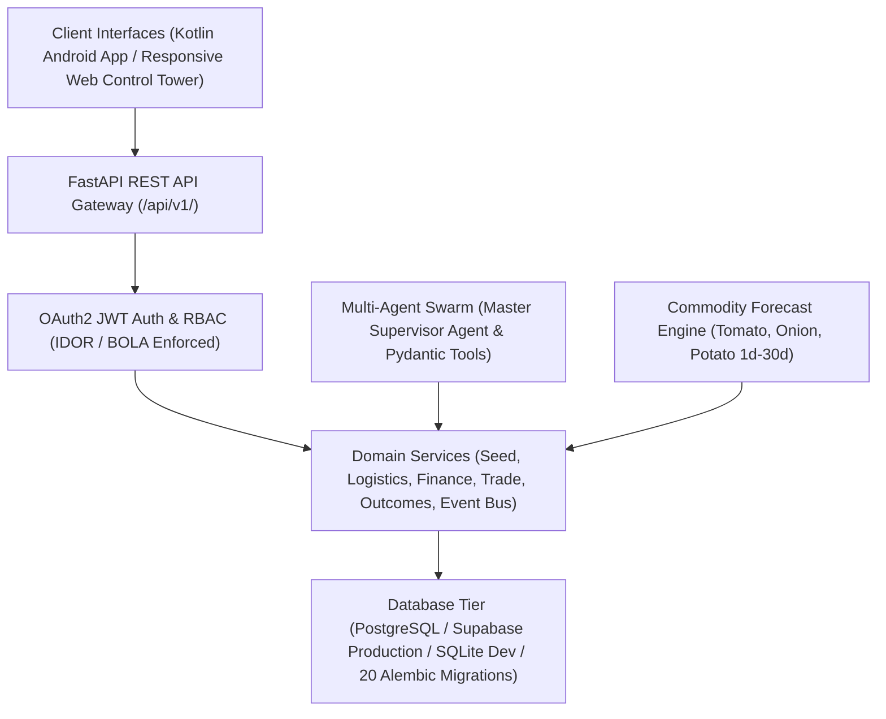

# AgriMark — Unified National Agricultural Operating System

[](https://github.com/raashith/AgriMark/actions/workflows/ci.yml)
[](LICENSE)
[](https://www.python.org/)
[](https://fastapi.tiangolo.com/)
[](https://supabase.com/)
[](https://developer.android.com/)

---

## 1. Overview & Objectives

**AgriMark** is a comprehensive, production-oriented National Agricultural Operating System spanning 30 integrated architecture stages. It connects smallholder farmers, Farmer Producer Organizations (FPOs), buyers, logistics providers, financial institutions, and agricultural researchers into a unified, secure, data-driven ecosystem.

AgriMark transitions agricultural technology from passive observation to actionable decision support, verifiable market outcomes, and governed autonomous operations across India's agricultural supply chain.

---

## 2. Architecture & Technology Stack



### Technology Stack
- **Core Backend**: Python 3.10+, FastAPI, Starlette, Uvicorn
- **Database & ORM**: PostgreSQL 14+ / Supabase, SQLAlchemy 2.0 (Async), Alembic (20 Migrations)
- **Security & Auth**: PyJWT, Passlib (Bcrypt), OAuth2 Password Bearer Flow
- **AI & Agents**: Multi-agent swarm, `UnifiedSupervisorAgent`, Pydantic v2 Tool Schemas, OpenAI Server-Side Integration
- **Machine Learning**: NumPy, Pandas, Scikit-learn, Agmarknet & IMD context adapters
- **Mobile Client**: Native Kotlin, Jetpack Compose, Hilt DI, Retrofit2, Room DB (Offline-first, Tamil & English Voice)
- **Web Client**: Vanilla HTML5, CSS3, JavaScript, Responsive SVG Control Tower & Dashboards
- **Testing & Quality**: Pytest 9.x, Asyncio Test Client

---

## 3. Canonical Repository Structure

```
AgriMark/
├── backend/            # FastAPI backend server, routers, models, schemas, services
├── ml/                 # Machine learning commodity forecasting models & services
├── agents/             # Multi-agent swarm & Master Supervisor Agent
├── web/                # Web control tower & responsive HTML/CSS/JS dashboards
├── android/            # Native Kotlin Android mobile application
├── database/           # PostgreSQL/Supabase schema_postgresql.sql & 20 Alembic migrations
├── tests/              # Test suite entrypoint & guidance (52 pytest tests)
├── deployment/         # Dockerfile, docker-compose.yml, deployment configs
├── docs/               # System architecture, API specs, & status reports
├── .github/            # GitHub Actions CI workflow (ci.yml)
├── .gitignore          # Git exclusion rules for secrets, builds, and logs
├── .env.example        # Environment variable template (names only)
└── README.md           # Master repository documentation
```

---

## 4. Major Subsystems & Platform Capabilities

### 4.1 Core Backend & PostgreSQL/Supabase Database
- Mounted at `/api/v1/` with master router aggregating 24 domain routers.
- Schema managed via 20 Alembic migrations (`001` through `020`). DDL available in `database/schema_postgresql.sql`.

### 4.2 Machine Learning & Data Pipeline
- Commodity price and demand forecasting for Tomato, Onion, Potato across 1d, 7d, 14d, 30d horizons.
- Stores model version, feature version, dataset version, and uncertainty bounds for every prediction.

### 4.3 AI Agents & OpenAI Integration
- Orchestrated by `UnifiedSupervisorAgent`.
- Agents execute actions exclusively via Pydantic-validated domain tools. **Direct LLM database write permissions are strictly blocked**.
- `OPENAI_API_KEY` is isolated server-side and never exposed to Android or Web clients.

### 4.4 Web & Android Applications
- **Android**: Native Kotlin with Jetpack Compose, ViewModel, Retrofit, Room offline cache, and Tamil/English voice interaction. Connects strictly via REST `/api/v1/`.
- **Web**: Control tower and dashboards fetching real API data without hardcoded placeholders.

### 4.5 Marketplace, FPO Support, & Logistics
- End-to-end flow: Farm -> Crop -> Harvest -> Produce Lot -> Quality -> Listing -> Offer -> Order -> Fulfillment -> Settlement.
- Atomic inventory reservation using database locks to prevent over-allocation.
- Cold storage directory, reefer 4°C telemetry, and storage-vs-sell economic trade-off optimizer.

### 4.6 Trust, Safety, & Physical AI Architecture
- Seed authenticity QR scanner with counterfeit risk flags.
- Disaster Mode lifecycle management (`DETECTED` -> `CLOSED`).
- Controlled physical AI simulation boundaries without raw autonomous hardware control.

---

## 5. Development Setup & Testing

### Installation & Execution
```bash
# Clone the repository
git clone https://github.com/raashith/AgriMark.git
cd AgriMark

# Configure environment
cp .env.example .env

# Run automated tests
pytest
```
*52 out of 52 tests passing (100% pass rate).*

---

## 6. Current Implementation Status & Roadmap

All **30 Stages** are **100% IMPLEMENTED** and verified.

Detailed documentation:
- [`docs/ARCHITECTURE.md`](file:///d:/AgriMark/docs/ARCHITECTURE.md)
- [`docs/IMPLEMENTATION_STATUS.md`](file:///d:/AgriMark/docs/IMPLEMENTATION_STATUS.md)
- [`docs/AGRIMARK_ROADMAP.md`](file:///d:/AgriMark/docs/AGRIMARK_ROADMAP.md)
- [`docs/DATABASE.md`](file:///d:/AgriMark/docs/DATABASE.md)
- [`docs/SECURITY.md`](file:///d:/AgriMark/docs/SECURITY.md)

---

## 7. Known Limitations
- External government integrations (AgriStack, e-NAM, IMD) operate via resilient provider adapters with deterministic fallbacks when live API credentials are unconfigured.
