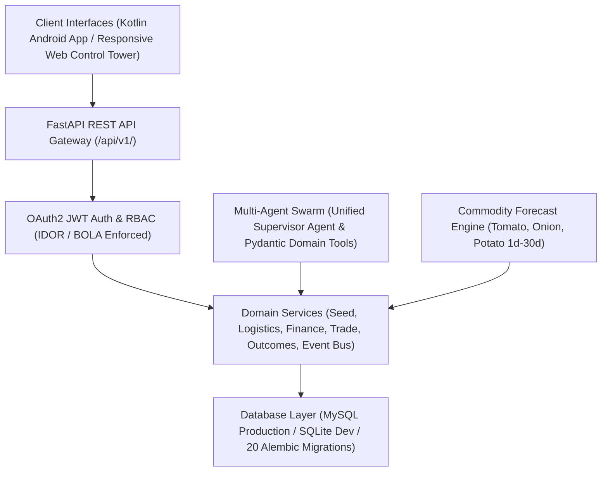

# AgriMark — Unified National Agricultural Operating System

[](https://github.com/raashith/AgriMark/actions/workflows/ci.yml)
[](LICENSE)
[](https://www.python.org/)
[](https://fastapi.tiangolo.com/)
[](https://developer.android.com/)

---

## 1. Purpose & Vision

**AgriMark** is a production-grade, end-to-end National Agricultural Operating System spanning 30 integrated architecture stages. It bridges smallholder farmers, Farmer Producer Organizations (FPOs), buyers, logistics providers, financial institutions, and agricultural researchers into a unified, secure, data-driven ecosystem.

AgriMark transitions digital agriculture from passive observation to actionable decision support, verifiable market outcomes, and governed autonomous operations across India's agricultural supply chain.

---

## 2. Platform Architecture

AgriMark implements a layered, service-oriented architecture:



---

## 3. Technology Stack

- **Core Backend**: Python 3.10+, FastAPI, Starlette, Uvicorn
- **Database & ORM**: MySQL 8.0, SQLAlchemy 2.0 (Async), Alembic (20 Migrations)
- **Security & Auth**: PyJWT, Passlib (Bcrypt), OAuth2 Password Bearer Flow
- **AI & Agents**: Multi-agent swarm, `UnifiedSupervisorAgent`, Pydantic v2 Tool Schemas, OpenAI Server-Side Integration
- **Machine Learning**: NumPy, Pandas, Scikit-learn, Agmarknet & IMD context adapters
- **Mobile Client**: Native Kotlin, Jetpack Compose, Hilt DI, Retrofit2, Room DB (Offline-first, Tamil & English Voice)
- **Web Client**: Vanilla HTML5, CSS3, JavaScript, Responsive SVG Control Tower & Dashboards
- **Testing & Quality**: Pytest 9.x, Asyncio Test Client

---

## 4. Repository Structure

```
AgriMark/
├── backend/            # FastAPI backend server, routers, models, schemas, services
├── ml/                 # Machine learning commodity forecasting models & services
├── agents/             # Multi-agent swarm & Master Supervisor Agent
├── web/                # Web control tower & responsive HTML/CSS/JS dashboards
├── android/            # Native Kotlin Android mobile application
├── database/           # MySQL DDL schema.sql & 20 Alembic migrations
├── tests/              # Test suite entrypoint & guidance
├── deployment/         # Dockerfile, docker-compose.yml, deployment configs
├── docs/               # System architecture, API specs, & status reports
├── .github/            # GitHub Actions CI workflow (ci.yml)
├── .gitignore          # Git exclusion rules for secrets, builds, and logs
├── .env.example        # Environment variable template (names only)
└── README.md           # Master repository documentation
```

---

## 5. Major Platform Capabilities

1. **Farmer Marketplace & Supply Chain**:
   - End-to-end lifecycle: Farm -> Crop -> Cultivation -> Harvest -> Produce Lot -> Quality -> Listing -> Offer -> Order -> Fulfillment -> Settlement.
   - Atomic inventory reservation preventing negative stock or over-booking.

2. **Seed & Genetic Intelligence (Stage 26)**:
   - Germplasm registry, Tamil trait ontology, GxE stability analysis, QR authenticity scanner with counterfeit risk flags.

3. **Logistics & Cold Storage (Stage 27)**:
   - Cold storage directory, reefer transport telemetry (4°C monitor), storage-vs-sell economic trade-off optimizer.

4. **Finance & Allied Agriculture (Stage 28)**:
   - Non-guaranteed decision-support credit risk engine, livestock/dairy/poultry/fisheries registry.

5. **Global Trade & Climate Resilience (Stage 29)**:
   - Landed export cost calculator, digital Product Passports, circular waste tracking, Disaster Mode lifecycle management (`DETECTED` -> `CLOSED`).

6. **Unified Decision Engine (Stage 30)**:
   - Standardized Decision Cards (Question, Recommendation, Why, Evidence, Confidence, Risk, Next Steps).

---

## 6. AI, ML, & Data Architecture

- **AI Architecture**: Multi-agent swarm led by `UnifiedSupervisorAgent`. All agent actions execute via Pydantic-validated domain tools. **Direct database writes by LLMs are strictly blocked**.
- **ML Architecture**: Predicts market prices and demand for Tomato, Onion, and Potato across 1-day, 7-day, 14-day, and 30-day horizons with uncertainty bounds and provenance tracking.
- **Data Architecture**: Governance via Data Commons contract registry, consent management, and adapter-based external data provider fallbacks (IMD, Agmarknet, ISRO, e-NAM).

---

## 7. Security Principles & Human Approval Requirements

- **Server-Side Key Isolation**: `OPENAI_API_KEY` resides strictly on the server and is never sent to Android or web clients.
- **Tenant Isolation**: Object-level authorization prevents Farmer A from accessing Farmer B's private farms, inventory, or financial records.
- **Human Approval Safeguards**: AI agents cannot autonomously transfer funds, approve loans/insurance, alter regulated records, apply chemicals, or change seller prices without explicit human authorization.

---

## 8. Development Setup & Testing

### Prerequisites
- Python 3.10+
- MySQL 8.0 or SQLite (default fallback)

### Installation
```bash
# Clone the repository
git clone https://github.com/raashith/AgriMark.git
cd AgriMark

# Create virtual environment
python -m venv backend/venv
# Activate environment (Windows)
backend\venv\Scripts\activate
# Activate environment (Linux/macOS)
source backend/venv/bin/activate

# Install dependencies
pip install -r backend/requirements.txt
```

### Environment Configuration
```bash
cp .env.example .env
# Edit .env with your environment settings
```

### Run Tests
```bash
pytest
```
*52 out of 52 tests passing (100% pass rate).*

### Run Development Server
```bash
cd backend
uvicorn app.main:app --host 0.0.0.0 --port 8000 --reload
```

---

## 9. Current Implementation Status

All **30 Stages** are **100% IMPLEMENTED** and empirically verified.
Detailed status breakdown: [`docs/IMPLEMENTATION_STATUS.md`](file:///d:/AgriMark/docs/IMPLEMENTATION_STATUS.md) and [`docs/PRODUCTION_READINESS_REPORT.md`](file:///d:/AgriMark/docs/PRODUCTION_READINESS_REPORT.md).
